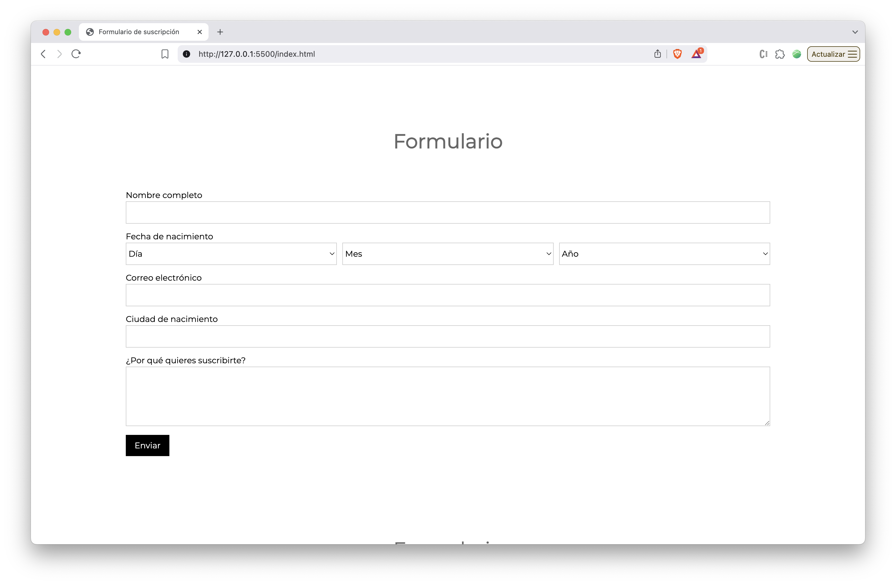

# Formulario

Ejercicio de creación de un formulario con HTML y su equivalente en JavaScript DOM.

## HTML

El formulario consta de los siguientes campos:

- Nombre completo
- Fecha de nacimiento
- Correo electrónico
- Ciudad
- Motivo

## JavaScript DOM

El formulario consta de los mismos campos que el formulario HTML, pero los campos se crean dinámicamente con JavaScript DOM.

Las funciones utilizadas para crear el formulario son:

- `createElement` - Crea un elemento HTML
- `appendChild` - Añade un elemento HTML como hijo de otro
- `addEventListener` - Añade un listener a un elemento HTML
- `classList.add` - Añade una clase a un elemento HTML
- `style` - Añade estilos a un elemento HTML
- `innerHTML` - Añade contenido HTML a un elemento HTML
- `value` - Añade un valor a un elemento HTML
- `textContent` - Añade contenido de texto a un elemento HTML
- `required` - Añade un atributo required a un elemento HTML
- `id` - Añade un id a un elemento HTML
- `name` - Añade un nombre a un elemento HTML
- `type` - Añade un tipo a un elemento HTML
- `rows` - Añade un número de filas a un elemento TextArea
- `htmlFor` - Añade un htmlFor a un elemento HTML